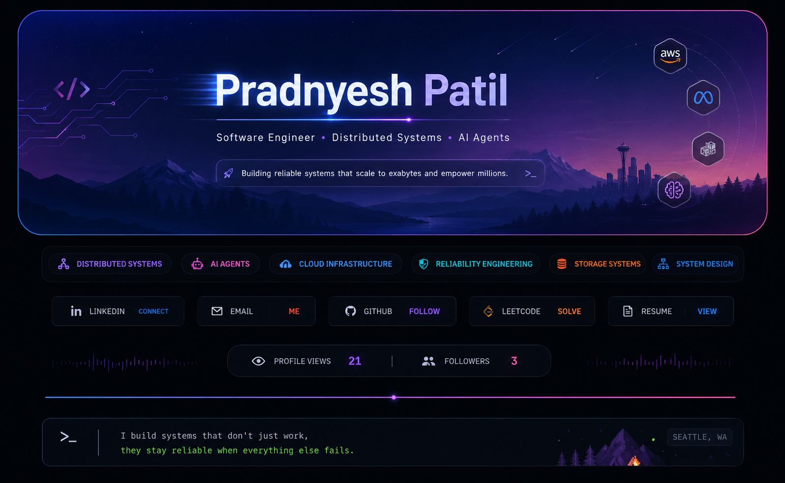
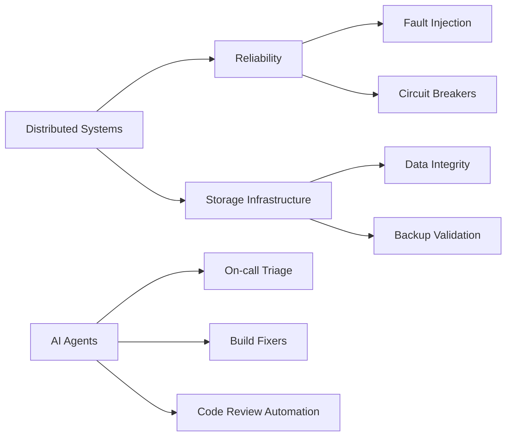

<!-- 🌌 Premium Developer Portfolio Header -->

 

<!-- Small live typing line under the image -->

---

## 🎯 About Me

<table>
<tr>
<td width="25%" align="center">
  
   <b>Meta</b>
</td>
<td width="25%" align="center">
  
   <b>Reliability + Backup Systems</b>
</td>
<td width="25%" align="center">
  
   <b>PNW Engineer</b>
</td>
<td width="25%" align="center">
  
   <b>Agents + Automation</b>
</td>
</tr>
</table>

<table>
<tr>
<td width="58%" valign="top">

### 👋 Quick Intro

I’m a software engineer focused on building **reliable, scalable, and fault-tolerant systems**. My work spans storage infrastructure, distributed systems, cloud services, data integrity, and AI-powered engineering workflows.

I enjoy solving problems where correctness, scale, and reliability matter — especially systems that need to keep working when dependencies fail.

 

</td>
<td width="42%" valign="top">

### 🚀 I Like Building

<table>
<tr><td>🧯</td><td><b>Fault-tolerant distributed systems</b></td></tr>
<tr><td>🔐</td><td><b>Data integrity pipelines</b></td></tr>
<tr><td>☁️</td><td><b>Cloud-native backend services</b></td></tr>
<tr><td>🤖</td><td><b>AI agents for engineering workflows</b></td></tr>
<tr><td>🛡️</td><td><b>Resilience patterns at scale</b></td></tr>
</table>

</td>
</tr>
</table>

---

## 🧑‍💻 Career Runtime

<table>
<tr>
<td width="50%" valign="top">

### ✅ Current Process

| Field | Value |
|---|---|
| **Service** | `pradnyesh.service` |
| **Status** | ✅ Active / Running |
| **Role** | Software Engineer · Reliability Builder |
| **Basecamp** | Seattle, WA 🌲 |
| **Focus** | Distributed Systems · Storage Infra · AI Agents |

</td>
<td width="50%" valign="top">

### ⚙️ Running Modules

| Daemon | Responsibility |
|---|---|
| `circuit-breakerd` | Fault isolation + dependency resilience |
| `metadata-signerd` | Data integrity + verification systems |
| `deletion-guardd` | Safety limits against accidental data loss |
| `de-spofd` | Self-healing services + automated failover |
| `ai-agentd` | Triage bots · build fixers · code reviewers |

</td>
</tr>
</table>

<table>
<tr>
<td align="center" width="25%"><b>⛰️ 06:00</b> Alpine start initialized</td>
<td align="center" width="25%"><b>☕ 09:30</b> Coffee dependency available</td>
<td align="center" width="25%"><b>📚 20:15</b> Context window expanded</td>
<td align="center" width="25%"><b>✅ 23:59</b> Health check passed</td>
</tr>
</table>

---

## ⚡ Large-Scale Challenges I Care About

<table>
<tr>
<td width="50%" valign="top">

### 🧯 Resilience at Scale
Building circuit breakers, fault injection systems, fail-open safeguards, and recovery validation to prevent dependency failures from becoming outages.

</td>
<td width="50%" valign="top">

### 🔏 Trustworthy Data Systems
Designing metadata signing, read-after-write verification, and validation pipelines to detect corruption before it becomes customer impact.

</td>
</tr>
<tr>
<td width="50%" valign="top">

### 🛡️ Safety Guardrails
Creating rate limiters, deletion-safety systems, and backup validators that protect customer data at massive scale.

</td>
<td width="50%" valign="top">

### 🤖 AI Agents That Work
Exploring autonomous agents for on-call triage, build failure diagnosis, codebase auditing, and multi-agent code review workflows.

</td>
</tr>
<tr>
<td width="50%" valign="top">

### ⚙️ De-SPOF Engineering
Transforming singleton services into resilient systems with dynamic shard assignment, automated failover, and controlled rollout strategies.

</td>
<td width="50%" valign="top">

### ☁️ Cloud Foundations
Experience across AWS services, backend APIs, full-stack delivery, async processing, and industrial IoT systems.

</td>
</tr>
</table>

---

## 🛠️ Tech Arsenal

### Languages

### Backend, Frontend & Cloud

### Databases & Tools

  

---

## 🤖 AI Engineering Stack

<table>
<tr>
<td align="center" width="25%">

 LLM workflows
</td>
<td align="center" width="25%">

 Agentic coding
</td>
<td align="center" width="25%">

 Reasoning + research
</td>
<td align="center" width="25%">

 AI-assisted development
</td>
</tr>
</table>

---

## 📌 Featured Focus Areas

---

## 📊 GitHub & LeetCode Dashboard

  

  

  

---

## 🐍 Contribution Snake

---

## ⛰️ Beyond the Code

<table>
<tr>
<td width="33%" align="center" valign="top">

### 🥾 Hiking
PNW trails, alpine lakes, and quiet miles above the treeline.

</td>
<td width="33%" align="center" valign="top">

### ☕ Coffee
Seattle compliance mode: espresso in, reliable systems out.

</td>
<td width="33%" align="center" valign="top">

### 📚 Reading
Engineering books, biographies, fiction, and trail audiobooks.

</td>
</tr>
</table>

---

## 🤝 Let’s Connect

  

### ✨ “Build with patience, learn with curiosity, and keep shipping until your dreams become systems the world can use.” ✨

